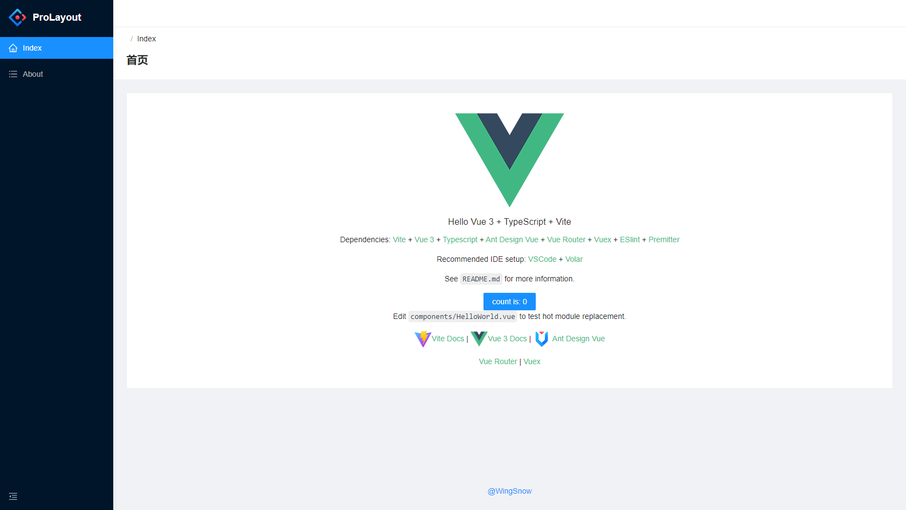

<h1 align="center">Vite Antdv Starter</h1>

<p align="center">


---

## 简介

一个极简的后台模板，基于`Vite2` + `Vue 3` + `Ant Design Vue`，旨在提供可快速重用的启动模板。



## 集成

- `Vue3` + `Vite2` + `Vue Router` + `Vuex`

- `TypeScript`

- `Ant Design Vue` + `Icons` + `Pro Layout`

- `Sass`

- `ESlint` + `Prettier` + `EditorConfig`

- `unplugin-vue-components`

## 安装

```bash
git clone https://gitee.com/wingsnow/vite-antdv-starter.git my-project

cd my-project

npm install

npm run dev
```

## 特性

### 自动引入

使用`unplugin-vue-components`插件自动引入ui库和`src/components`目录下的组件

### 布局

使用Ant Design Vue Pro的Pro Layout@next插件进行布局，用于生成菜单栏和面包屑导航等基本框架

### 路由和菜单

- 路由文件：通过约定的语法根据在`router/index.ts`中配置路由
- 菜单根据路由配置自动生成

### 图标

在`main.ts`中全局引入了所有`ant-design-icon`组件
